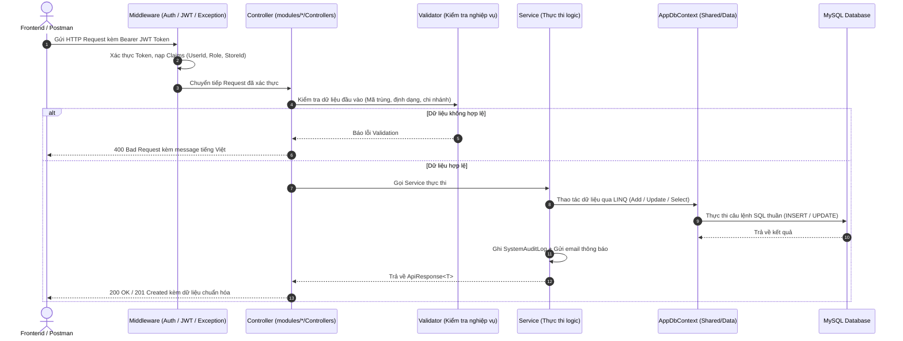
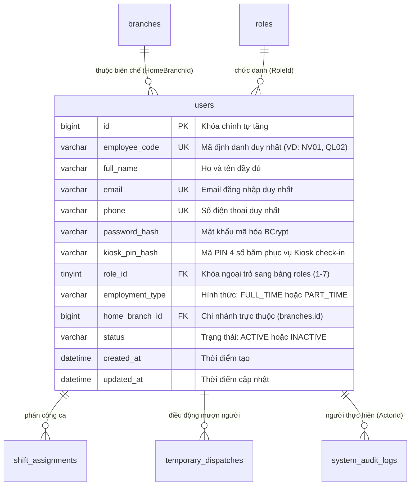
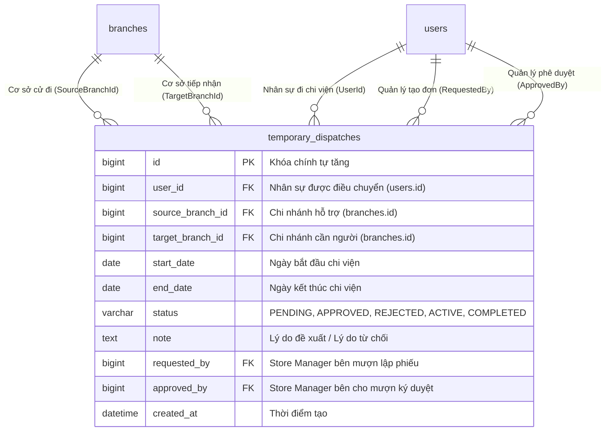

# TÀI LIỆU CHI TIẾT: LUỒNG KHAI BÁO NHÂN SỰ VÀ ĐIỀU CHUYỂN NHÂN SỰ TẠM THỜI
**Dự án**: HRM - Retail Workforce Management (HRM-Retail WFM Backend - .NET 8)  
**Tài liệu dành cho**: Sinh viên / Developer giải trình đồ án, tra cứu code và trả lời phản biện Giảng viên.

---

# MỤC LỤC
1. [TỔNG QUAN KIẾN TRÚC & NGUYÊN LÝ HOẠT ĐỘNG](#1-tổng-quan-kiến-trúc--nguyên-lý-hoạt-động)
2. [PHẦN I: LUỒNG KHAI BÁO NHÂN SỰ (EMPLOYEE ONBOARDING)](#2-phần-i-luồng-khai-báo-nhân-sự-employee-onboarding)
   - [2.1 Danh sách Class & File liên quan](#21-danh-sách-class--file-liên-quan)
   - [2.2 Chi tiết từng Hàm và Chức năng](#22-chi-tiết-từng-hàm-và-chức-năng)
   - [2.3 Cấu trúc Dữ liệu & Bảng CSDL liên quan](#23-cấu-trúc-dữ-liệu--bảng-csdl-liên-quan)
   - [2.4 Cơ chế Phân quyền (Authorization & Claims)](#24-cơ-chế-phân-quyền-authorization--claims)
   - [2.5 Truy vấn Dữ liệu (Query / LINQ)](#25-truy-vấn-dữ-liệu-query--linq)
   - [2.6 Tác động đến các Thành viên khác trong Team (Dependencies)](#26-tác-động-đến-các-thành-viên-khác-trong-team-dependencies)
3. [PHẦN II: LUỒNG ĐIỀU CHUYỂN NHÂN SỰ TẠM THỜI (TEMPORARY DISPATCH)](#3-phần-ii-luồng-điều-chuyển-nhân-sự-tạm-thời-temporary-dispatch)
   - [3.1 Danh sách Class & File liên quan](#31-danh-sách-class--file-liên-quan)
   - [3.2 Chi tiết từng Hàm và Chức năng](#32-chi-tiết-từng-hàm-và-chức-năng)
   - [3.3 Cấu trúc Dữ liệu & Bảng CSDL liên quan](#33-cấu-trúc-dữ-liệu--bảng-csdl-liên-quan)
   - [3.4 Cơ chế Phân quyền & Quy tắc Nghiệp vụ](#34-cơ-chế-phân-quyền--quy-tắc-nghiệp-vụ)
   - [3.5 Truy vấn Dữ liệu (Query / LINQ)](#35-truy-vấn-dữ-liệu-query--linq)
   - [3.6 Tác động đến các Thành viên khác trong Team (Dependencies)](#36-tác-động-đến-các-thành-viên-khác-trong-team-dependencies)
4. [BẢNG TRA CỨU NHANH KHI GIÁO VIÊN YÊU CẦU CHỈNH SỬA CODE](#4-bảng-tra-cứu-nhanh-khi-giáo-viên-yêu-cầu-chỉnh-sửa-code)
5. [CÁC CÂU HỎI GIẢNG VIÊN THƯỜNG HỎI & CÁCH TRẢ LỜI](#5-các-câu-hỏi-giảng-viên-thường-hỏi--cách-trả-lời)

---

# 1. TỔNG QUAN KIẾN TRÚC & NGUYÊN LÝ HOẠT ĐỘNG

Dự án được xây dựng trên nền tảng **ASP.NET Core (.NET 8)** theo mô hình **Modular Monolith** kết hợp **Clean Architecture**:
- **Cổng vào hệ thống**: Thư mục `API/` chứa `Program.cs` cấu hình Dependency Injection (DI), Middleware, CORS, Serilog, Swagger và JWT Bearer.
- **Tầng nghiệp vụ (Business Modules)**: Nằm trong `modules/`, mỗi phân hệ được cô lập thành một thư mục riêng biệt gồm:
  - `Controllers/`: Nhận request HTTP, đọc Claims danh tính từ Token, kiểm tra quyền Role-based (`[Authorize]`).
  - `Interfaces/`: Định nghĩa hợp đồng nghiệp vụ (Contract Interface).
  - `Services/`: Xử lý nghiệp vụ logic, tính toán, băm mật khẩu, gọi CSDL và gửi mail/audit log.
  - `DTOs/`: Chứa các đối tượng truyền dữ liệu (Data Transfer Objects) an toàn giữa Client và Server.
- **Tầng dữ liệu dùng chung (Shared & Domain)**:
  - `Domain/Entities/`: Chứa các thực thể tương ứng với bảng trong MySQL (`User`, `Branch`, `TemporaryDispatch`...).
  - `Shared/Data/AppDbContext.cs`: Khai báo `DbSet<T>`, cấu hình Fluent API, khóa ngoại, unique index và hành vi xóa (`OnDelete`).
  - `Shared/Data/DbInitializer.cs`: Tự động kiểm tra/tạo bảng CSDL và nạp dữ liệu mẫu ban đầu.

### Sơ đồ luồng xử lý Request chuẩn:


---

# 2. PHẦN I: LUỒNG KHAI BÁO NHÂN SỰ (EMPLOYEE ONBOARDING)

Tính năng này chịu trách nhiệm cấp tài khoản, hồ sơ nhân viên, mã PIN điểm danh Kiosk và phân bổ nhân sự vào từng chi nhánh.

---

### 2.1 Danh sách Class & File liên quan

| Tên Class / Interface | Đường dẫn File (Click để mở) | Vai trò & Trách nhiệm |
| :--- | :--- | :--- |
| `UsersController` | [`modules/Auth/Controllers/UsersController.cs`](file:///e:/SWP391/Project/hrm_r_wfm_be/modules/Auth/Controllers/UsersController.cs) | Controller RESTful tiếp nhận các request liên quan đến tài khoản & hồ sơ nhân sự, phân quyền `[Authorize]`. |
| `IUserService` | [`modules/Auth/Interfaces/IUserService.cs`](file:///e:/SWP391/Project/hrm_r_wfm_be/modules/Auth/Interfaces/IUserService.cs) | Interface định nghĩa các hàm nghiệp vụ: tạo nhân viên, tạo quản lý, cập nhật, đổi trạng thái, reset mật khẩu. |
| `UserService` | [`modules/Auth/Services/UserService.cs`](file:///e:/SWP391/Project/hrm_r_wfm_be/modules/Auth/Services/UserService.cs) | Class thực thi `IUserService`: hash mật khẩu BCrypt, lưu User vào DB, ghi Audit Log, gửi Email chào mừng. |
| `IEmployeeValidator` | [`modules/Auth/Interfaces/IEmployeeValidator.cs`](file:///e:/SWP391/Project/hrm_r_wfm_be/modules/Auth/Interfaces/IEmployeeValidator.cs) | Interface định nghĩa các phương thức thẩm định hồ sơ nhân sự trước khi lưu CSDL. |
| `EmployeeValidator` | [`modules/Auth/Services/EmployeeValidator.cs`](file:///e:/SWP391/Project/hrm_r_wfm_be/modules/Auth/Services/EmployeeValidator.cs) | Class thực thi kiểm tra nghiệp vụ: kiểm tra mã NV, trùng email, trùng SĐT, kiểm tra vai trò và chi nhánh hợp lệ. |
| `EmployeeDTOs` | [`modules/Auth/DTOs/EmployeeDTOs.cs`](file:///e:/SWP391/Project/hrm_r_wfm_be/modules/Auth/DTOs/EmployeeDTOs.cs) | Khai báo các đối tượng dữ liệu: `CreateEmployeeDto`, `UpdateEmployeeDto`, `EmployeeDetailDto`, `EmployeeFilterDto`... |
| `User` | [`Domain/Entities/User.cs`](file:///e:/SWP391/Project/hrm_r_wfm_be/Domain/Entities/User.cs) | Entity đại diện cho bảng `users` trong cơ sở dữ liệu MySQL. |
| `AppDbContext` | [`Shared/Data/AppDbContext.cs`](file:///e:/SWP391/Project/hrm_r_wfm_be/Shared/Data/AppDbContext.cs) | Thiết lập ánh xạ Entity `User` với bảng `users`, cấu hình Unique Index và Foreign Key. |

---

### 2.2 Chi tiết từng Hàm và Chức năng

#### A. Trong `UsersController.cs`:
- **`GetStoreManagers()`** ([UsersController.cs:30](file:///e:/SWP391/Project/hrm_r_wfm_be/modules/Auth/Controllers/UsersController.cs#L30)):
  - **Route**: `GET /api/Users/store-managers`
  - **Quyền**: Chỉ Admin (`OPERATIONS_ADMIN`, `BUSINESS_OWNER`).
  - **Chức năng**: Lấy danh sách toàn bộ tài khoản Cửa hàng trưởng toàn chuỗi kèm tên chi nhánh trực thuộc.
- **`CreateStoreManager([FromBody] CreateStoreManagerDto dto)`** ([UsersController.cs:41](file:///e:/SWP391/Project/hrm_r_wfm_be/modules/Auth/Controllers/UsersController.cs#L41)):
  - **Route**: `POST /api/Users/store-managers`
  - **Quyền**: Chỉ Admin (`OPERATIONS_ADMIN`, `BUSINESS_OWNER`).
  - **Chức năng**: Cấp tài khoản quản trị cho Cửa hàng trưởng, gán cố định vào chi nhánh quản lý.
- **`GetEmployees([FromQuery] EmployeeFilterDto filter)`** ([UsersController.cs:84](file:///e:/SWP391/Project/hrm_r_wfm_be/modules/Auth/Controllers/UsersController.cs#L84)):
  - **Route**: `GET /api/Users/employees`
  - **Quyền**: Admin và Store Manager.
  - **Chức năng**: Lấy danh sách hồ sơ nhân sự có lọc theo chi nhánh, vai trò, loại hợp đồng, trạng thái hoặc từ khóa tìm kiếm.
- **`GetEmployeeById(ulong id)`** ([UsersController.cs:97](file:///e:/SWP391/Project/hrm_r_wfm_be/modules/Auth/Controllers/UsersController.cs#L97)):
  - **Route**: `GET /api/Users/employees/{id}`
  - **Chức năng**: Xem chi tiết hồ sơ cá nhân của một nhân sự theo ID.
- **`CreateEmployee([FromBody] CreateEmployeeDto dto)`** ([UsersController.cs:110](file:///e:/SWP391/Project/hrm_r_wfm_be/modules/Auth/Controllers/UsersController.cs#L110)):
  - **Route**: `POST /api/Users/employees`
  - **Chức năng**: Khai báo nhân sự mới thuộc các vai trò vận hành (`SHIFT_LEADER`, `CASHIER`, `SALES_STAFF`, `SECURITY_GUARD`).
  - **Phân quyền tập trung**: Độc quyền dành cho Quản trị viên (Admin) để kiểm soát định biên nhân sự toàn chuỗi.
- **`UpdateEmployee(ulong id, [FromBody] UpdateEmployeeDto dto)`** ([UsersController.cs:123](file:///e:/SWP391/Project/hrm_r_wfm_be/modules/Auth/Controllers/UsersController.cs#L123)):
  - **Route**: `PUT /api/Users/employees/{id}`
  - **Chức năng**: Cập nhật thông tin họ tên, số điện thoại, vai trò, loại hợp đồng và điều chuyển chi nhánh (`HomeBranchId`).
- **`ToggleUserStatus(ulong id, [FromBody] UpdateStatusDto dto)`** ([UsersController.cs:54](file:///e:/SWP391/Project/hrm_r_wfm_be/modules/Auth/Controllers/UsersController.cs#L54)):
  - **Route**: `PATCH /api/Users/{id}/status`
  - **Chức năng**: Khóa (`INACTIVE`) hoặc kích hoạt lại (`ACTIVE`) tài khoản nhân sự.
- **`ResetPassword(ulong id, [FromBody] ResetPasswordDto dto)`** ([UsersController.cs:67](file:///e:/SWP391/Project/hrm_r_wfm_be/modules/Auth/Controllers/UsersController.cs#L67)):
  - **Route**: `POST /api/Users/{id}/reset-password`
  - **Chức năng**: Đặt lại mật khẩu đăng nhập cho nhân viên khi quên mật khẩu.

---

#### B. Trong `EmployeeValidator.cs`:
- **`ValidateCreateEmployeeAsync(CreateEmployeeDto dto, string actorRole, ulong? actorBranchId)`** ([EmployeeValidator.cs:22](file:///e:/SWP391/Project/hrm_r_wfm_be/modules/Auth/Services/EmployeeValidator.cs#L22)):
  - Kiểm tra trường rỗng: Bắt buộc phải có `EmployeeCode`, `FullName`, `Email`, `Phone`.
  - Kiểm tra vai trò (`RoleId`): Phải thuộc 5 vai trò cửa hàng (`STORE_MANAGER`, `SHIFT_LEADER`, `CASHIER`, `SALES_STAFF`, `SECURITY_GUARD`).
  - Kiểm tra thẩm quyền tạo: Nếu tài khoản thao tác là `STORE_MANAGER`, chặn lại vì Store Manager không được trực tiếp tạo nhân sự mà phải lập Yêu cầu tuyển dụng.
  - Kiểm tra chi nhánh (`HomeBranchId`): Chi nhánh chỉ định phải tồn tại và đang `ACTIVE`.
  - Chống trùng lặp dữ liệu:
    - Mã nhân viên: `!_context.Users.AnyAsync(u => u.EmployeeCode == normalizedCode)`
    - Email: `!_context.Users.AnyAsync(u => u.Email == normalizedEmail)`
    - Số điện thoại: `!_context.Users.AnyAsync(u => u.Phone == normalizedPhone)`
- **`ValidateUpdateEmployeeAsync(User user, UpdateEmployeeDto dto, string actorRole, ulong? actorBranchId)`** ([EmployeeValidator.cs:96](file:///e:/SWP391/Project/hrm_r_wfm_be/modules/Auth/Services/EmployeeValidator.cs#L96)):
  - Kiểm tra vai trò mục tiêu tồn tại.
  - Kiểm tra chống trùng SĐT nếu nhân viên đổi số mới: `!_context.Users.AnyAsync(u => u.Phone == normalizedPhone && u.Id != user.Id)`.

---

#### C. Trong `UserService.cs`:
- **`CreateEmployeeAsync(dto, actorId, actorRole, actorBranchId, ipAddress)`** ([UserService.cs:288](file:///e:/SWP391/Project/hrm_r_wfm_be/modules/Auth/Services/UserService.cs#L288)):
  1. Gọi `_employeeValidator.ValidateCreateEmployeeAsync(...)`. Nếu thất bại trả về `ApiResponse.Fail(...)`.
  2. Băm mật khẩu bằng `_passwordHasher.Hash(plainPassword)` (mặc định nếu trống là `Password@123`).
  3. Khởi tạo đối tượng `User` mới với `Status = "ACTIVE"`, gán `HomeBranchId` theo chi nhánh được phân bổ.
  4. Lưu CSDL: `_context.Users.Add(newUser); await _context.SaveChangesAsync();`.
  5. Ghi Audit Log vào bảng `system_audit_logs` qua `_auditLogService.LogAsync(...)`.
  6. Gửi Email thông báo tài khoản & mật khẩu cho nhân viên qua `_notificationService.SendWelcomeNotificationAsync(...)`.
  7. Trả về `EmployeeDetailDto` chuẩn hóa.

---

### 2.3 Cấu trúc Dữ liệu & Bảng CSDL liên quan



- **Bảng `users`**: Bảng trung tâm lưu trữ toàn bộ người dùng trong hệ thống.
- **Bảng `roles`**: Bảng chứa danh mục 7 vai trò:
  - `1`: `BUSINESS_OWNER` (Chủ doanh nghiệp)
  - `2`: `OPERATIONS_ADMIN` (Quản trị vận hành)
  - `3`: `STORE_MANAGER` (Cửa hàng trưởng)
  - `4`: `SHIFT_LEADER` (Trưởng ca)
  - `5`: `CASHIER` (Thu ngân)
  - `6`: `SALES_STAFF` (Nhân viên bán hàng)
  - `7`: `SECURITY_GUARD` (Nhân viên bảo vệ)
- **Bảng `branches`**: Bảng chi nhánh. Cột `users.home_branch_id` liên kết FK với `branches.id`. Trong [`AppDbContext.cs:82`](file:///e:/SWP391/Project/hrm_r_wfm_be/Shared/Data/AppDbContext.cs#L82), quan hệ được cấu hình `OnDelete(DeleteBehavior.SetNull)` để bảo vệ dữ liệu nhân viên không bị mất khi chi nhánh ngừng hoạt động.

---

### 2.4 Cơ chế Phân quyền (Authorization & Claims)

Phân quyền áp dụng theo 2 cấp:
1. **Cấp Controller (`[Authorize(Roles = "...")]`)**:
   Hệ thống kiểm tra claim `ClaimTypes.Role` trong JWT Token của người gửi Request.
2. **Cấp Service / Context (Hàm `GetCurrentUserInfo()`)**:
   - `actorId`: Trích xuất từ `ClaimTypes.NameIdentifier`.
   - `role`: Trích xuất từ `ClaimTypes.Role`.
   - `branchId`: Trích xuất từ Claim `StoreId`.
   - `ip`: Lấy địa chỉ IP từ `HttpContext.Connection.RemoteIpAddress`.

> [!NOTE]
> **Quy định nghiệp vụ mới:** Khai báo nhân sự mới (`POST /api/Users/employees`) và phân bổ nhân sự vào chi nhánh là thẩm quyền độc quyền của **Admin** (`OPERATIONS_ADMIN`, `BUSINESS_OWNER`) nhằm kiểm soát định biên nhân sự tập trung. Cửa hàng trưởng khi thiếu người sẽ lập **Yêu cầu tuyển dụng** gửi lên Admin.

---

### 2.5 Truy vấn Dữ liệu (Query / LINQ)

Vị trí: [`modules/Auth/Services/UserService.cs:175`](file:///e:/SWP391/Project/hrm_r_wfm_be/modules/Auth/Services/UserService.cs#L175) trong hàm `GetEmployeesAsync`:
```csharp
var query = _context.Users
    .Include(u => u.Role)
    .Include(u => u.HomeBranch)
    .AsQueryable();

// Ràng buộc bảo mật dữ liệu theo phạm vi:
// Nếu người gọi là Cửa hàng trưởng -> Buộc chỉ được xem nhân viên thuộc chi nhánh mình
if (actorRole == "STORE_MANAGER")
{
    query = query.Where(u => u.HomeBranchId == actorBranchId.Value);
    query = query.Where(u => u.Role.RoleCode != "STORE_MANAGER"); // Loại trừ quản lý khác
}
else if (filter.BranchId.HasValue && filter.BranchId.Value > 0)
{
    query = query.Where(u => u.HomeBranchId == filter.BranchId.Value);
}

// Lọc theo vai trò, hợp đồng, trạng thái
if (filter.RoleId.HasValue) query = query.Where(u => u.RoleId == filter.RoleId.Value);
if (!string.IsNullOrWhiteSpace(filter.Status)) query = query.Where(u => u.Status == filter.Status.ToUpper());

// Tìm kiếm đa trường (Tên, Mã NV, Email, SĐT)
if (!string.IsNullOrWhiteSpace(filter.Search))
{
    var search = filter.Search.Trim().ToLower();
    query = query.Where(u => u.FullName.ToLower().Contains(search)
                          || u.EmployeeCode.ToLower().Contains(search)
                          || u.Email.ToLower().Contains(search)
                          || u.Phone.Contains(search));
}
```

---

### 2.6 Tác động đến các Thành viên khác trong Team (Dependencies)

Khi bạn chỉnh sửa cấu trúc bảng `users` hoặc dữ liệu nhân sự, các module sau sẽ bị ảnh hưởng trực tiếp:

1. **Phân hệ Điểm danh Kiosk (`modules/Attendance`)**:
   - Nhân viên chỉ có thể check-in trên Kiosk nếu `users.status == "ACTIVE"` và `users.home_branch_id == branchId` của Kiosk đó.
   - Kiosk xác thực qua mã PIN 4 số băm tại cột `users.kiosk_pin_hash`.
2. **Phân hệ Lập lịch Ca (`modules/Shifts`)**:
   - Khi Cửa hàng trưởng xếp lịch làm việc (`shift_assignments`), hệ thống sẽ query danh sách `users` có `HomeBranchId == branchId` để hiển thị nhân viên khả dụng vào dropdown xếp ca.
3. **Phân hệ Giao ca Két tiền & An ninh (`modules/Handovers`)**:
   - Bàn giao két tiền (`cash_handovers.cashier_id`): Bắt buộc người ký phải có `role_id == 5` (CASHIER).
   - Bàn giao an ninh khóa kho (`security_handovers.security_guard_id`): Bắt buộc người ký phải có `role_id == 7` (SECURITY_GUARD).

---

# 3. PHẦN II: LUỒNG ĐIỀU CHUYỂN NHÂN SỰ TẠM THỜI (TEMPORARY DISPATCH)

Tính năng này xử lý nghiệp vụ mượn/cho mượn nhân sự tạm thời giữa các chi nhánh trong chuỗi (UC 4.1, UC 4.2).

---

### 3.1 Danh sách Class & File liên quan

| Tên Class / Interface | Đường dẫn File (Click để mở) | Vai trò & Trách nhiệm |
| :--- | :--- | :--- |
| `DispatchController` | [`modules/Dispatch/Controllers/DispatchController.cs`](file:///e:/SWP391/Project/hrm_r_wfm_be/modules/Dispatch/Controllers/DispatchController.cs) | Controller tiếp nhận các API: tạo yêu cầu mượn quân, duyệt/từ chối, sửa/hủy đơn, xem ma trận chi viện. |
| `IDispatchService` | [`modules/Dispatch/Interfaces/IDispatchService.cs`](file:///e:/SWP391/Project/hrm_r_wfm_be/modules/Dispatch/Interfaces/IDispatchService.cs) | Interface định nghĩa các phương thức xử lý điều chuyển nhân sự. |
| `DispatchService` | [`modules/Dispatch/Services/DispatchService.cs`](file:///e:/SWP391/Project/hrm_r_wfm_be/modules/Dispatch/Services/DispatchService.cs) | Xử lý logic trọng tâm: kiểm tra trùng ca cơ sở gốc, kiểm tra lệnh chồng chéo, duyệt đơn và tính ma trận giờ công. |
| `DispatchDTOs` | [`modules/Dispatch/DTOs/DispatchDTOs.cs`](file:///e:/SWP391/Project/hrm_r_wfm_be/modules/Dispatch/DTOs/DispatchDTOs.cs) | Chứa các DTO: `CreateDispatchRequestDto`, `ReviewDispatchRequestDto`, `DispatchRecordDto`, `DispatchNetworkMetricsDto`... |
| `TemporaryDispatch` | [`Domain/Entities/TemporaryDispatch.cs`](file:///e:/SWP391/Project/hrm_r_wfm_be/Domain/Entities/TemporaryDispatch.cs) | Entity đại diện cho bảng `temporary_dispatches` trong MySQL. |

---

### 3.2 Chi tiết từng Hàm và Chức năng

#### A. Trong `DispatchController.cs`:
- **`CreateDispatchRequest([FromBody] CreateDispatchRequestDto request)`** ([DispatchController.cs:25](file:///e:/SWP391/Project/hrm_r_wfm_be/modules/Dispatch/Controllers/DispatchController.cs#L25)):
  - **Route**: `POST /api/Dispatch/request`
  - **Chức năng**: Cửa hàng trưởng cơ sở thiếu người (Target Branch) lập phiếu xin mượn nhân sự từ cơ sở hỗ trợ (Source Branch).
- **`ReviewDispatchRequest([FromBody] ReviewDispatchRequestDto request)`** ([DispatchController.cs:42](file:///e:/SWP391/Project/hrm_r_wfm_be/modules/Dispatch/Controllers/DispatchController.cs#L42)):
  - **Route**: `POST /api/Dispatch/review`
  - **Chức năng**: Cửa hàng trưởng bên cơ sở hỗ trợ phê duyệt (`IsApproved = true`) hoặc từ chối (`IsApproved = false`), có quyền đổi sang nhân sự khác phù hợp hơn (`AssignedEmployeeId`).
- **`GetStoreDispatches(int storeId)`** ([DispatchController.cs:59](file:///e:/SWP391/Project/hrm_r_wfm_be/modules/Dispatch/Controllers/DispatchController.cs#L59)):
  - **Route**: `GET /api/Dispatch/store/{storeId}`
  - **Chức năng**: Lấy danh sách lệnh điều động liên quan đến cửa hàng (cả chiều cho mượn và chiều nhận mượn).
- **`GetAllDispatches([FromQuery] string? status, [FromQuery] int? storeId)`** ([DispatchController.cs:69](file:///e:/SWP391/Project/hrm_r_wfm_be/modules/Dispatch/Controllers/DispatchController.cs#L69)):
  - **Route**: `GET /api/Dispatch/all`
  - **Chức năng**: Dành cho Quản lý & Admin xem toàn bộ danh sách điều động toàn hệ thống có lọc.
- **`GetNetworkMetrics([FromQuery] string? fromDate, [FromQuery] string? toDate)`** ([DispatchController.cs:81](file:///e:/SWP391/Project/hrm_r_wfm_be/modules/Dispatch/Controllers/DispatchController.cs#L81)):
  - **Route**: `GET /api/Dispatch/network-metrics`
  - **Chức năng**: Dành cho Admin/Business Owner giám sát ma trận điều động theo cặp chi nhánh và tổng số giờ công chi viện toàn mạng lưới (UC 4.4).
- **`UpdateDispatchRequest(int id, [FromBody] UpdateDispatchRequestDto request)`** ([DispatchController.cs:97](file:///e:/SWP391/Project/hrm_r_wfm_be/modules/Dispatch/Controllers/DispatchController.cs#L97)):
  - **Route**: `PUT /api/Dispatch/request/{id}`
  - **Chức năng**: Chỉnh sửa thông tin đơn đề nghị chi viện khi đơn đang ở trạng thái chờ duyệt (`PENDING`).
- **`DeleteDispatchRequest(int id)`** ([DispatchController.cs:114](file:///e:/SWP391/Project/hrm_r_wfm_be/modules/Dispatch/Controllers/DispatchController.cs#L114)):
  - **Route**: `DELETE /api/Dispatch/request/{id}`
  - **Chức năng**: Hủy và xóa đơn đề nghị chi viện khi còn ở trạng thái `PENDING`.

---

#### B. Trong `DispatchService.cs`:
- **`CreateDispatchRequestAsync(requesterEmployeeId, request)`** ([DispatchService.cs:22](file:///e:/SWP391/Project/hrm_r_wfm_be/modules/Dispatch/Services/DispatchService.cs#L22)):
  - Kiểm tra `FromStoreId != ToStoreId`: Không cho phép điều động nội bộ trong cùng 1 chi nhánh.
  - Kiểm tra `StartDate <= EndDate` và `StartDate >= Today`: Không được tạo lệnh cho ngày trong quá khứ.
  - Kiểm tra cả 2 chi nhánh tồn tại và đang `ACTIVE`.
  - Kiểm tra nhân sự chỉ định phải thuộc biên chế của chi nhánh hỗ trợ: `user.HomeBranchId == request.FromStoreId`.
  - Tạo thực thể `TemporaryDispatch` với `Status = "PENDING"`, lưu vào MySQL.
- **`ReviewDispatchRequestAsync(approverEmployeeId, request)`** ([DispatchService.cs:102](file:///e:/SWP391/Project/hrm_r_wfm_be/modules/Dispatch/Services/DispatchService.cs#L102)):
  - Nếu từ chối (`IsApproved = false`): Đổi `Status = "REJECTED"`, ghi chú lý do từ chối vào `Note`.
  - Nếu phê duyệt (`IsApproved = true`):
    - **KIỂM TRA XUNG ĐỘT CA TRỰC CƠ SỞ GỐC**: Truy vấn bảng `shift_assignments` xem nhân sự đã có ca trực nào tại chi nhánh gốc trong khoảng `[StartDate, EndDate]` hay chưa. Nếu có $\rightarrow$ Chặn duyệt và yêu cầu gỡ ca trực trước.
    - **KIỂM TRA LỆNH ĐIỀU ĐỘNG CHỒNG CHÉO**: Kiểm tra xem nhân sự có đang nằm trong một lệnh điều động `APPROVED` khác có thời gian giao nhau hay không.
    - Sau khi vượt qua các kiểm tra: Cập nhật `Status = "APPROVED"`, `ApprovedBy = approverEmployeeId`.
- **`GetNetworkMetricsAsync(fromDate, toDate)`** ([DispatchService.cs:285](file:///e:/SWP391/Project/hrm_r_wfm_be/modules/Dispatch/Services/DispatchService.cs#L285)):
  - Nhóm dữ liệu theo cặp chi nhánh (`SourceBranchId` $\rightarrow$ `TargetBranchId`).
  - Đếm số lượt điều động và tính tổng giờ công chi viện:
    $$\text{TotalHours} = \sum (\text{EndDate} - \text{StartDate} + 1) \times 8.0 \text{ giờ}$$

---

### 3.3 Cấu trúc Dữ liệu & Bảng CSDL liên quan



---

### 3.4 Cơ chế Phân quyền & Quy tắc Nghiệp vụ

1. **Phân quyền Controller ([DispatchController.cs:12](file:///e:/SWP391/Project/hrm_r_wfm_be/modules/Dispatch/Controllers/DispatchController.cs#L12))**:
   ```csharp
   [Authorize(Roles = "STORE_MANAGER,SHIFT_LEADER,OPERATIONS_ADMIN,BUSINESS_OWNER")]
   ```
2. **Quy tắc Nghiệp vụ Kiểm tra Thẩm quyền chéo (Cross-Store Authorization)**:
   - **Tạo đơn**: Cửa hàng trưởng của cơ sở tiếp nhận (`ToStoreId`) tạo đơn xin quân.
   - **Phê duyệt đơn**: Chỉ Cửa hàng trưởng của cơ sở hỗ trợ (`SourceBranchId`) mới có thẩm quyền phê duyệt và chọn người cử đi.
   - **Sửa / Hủy đơn ([DispatchService.cs:405](file:///e:/SWP391/Project/hrm_r_wfm_be/modules/Dispatch/Services/DispatchService.cs#L405))**: Chỉ người tạo đơn (`dispatch.RequestedBy == managerId`), hoặc Store Manager bên nhận, hoặc Admin mới có quyền thao tác.

---

### 3.5 Truy vấn Dữ liệu (Query / LINQ)

Vị trí: [`modules/Dispatch/Services/DispatchService.cs:195](file:///e:/SWP391/Project/hrm_r_wfm_be/modules/Dispatch/Services/DispatchService.cs#L195) hàm `GetDispatchesByStoreAsync`:
```csharp
// Lấy danh sách lệnh mà chi nhánh là bên cho mượn HOẶC bên nhận mượn
var dispatches = await _context.TemporaryDispatches
    .Include(d => d.User).ThenInclude(u => u.Role)
    .Include(d => d.SourceBranch)
    .Include(d => d.TargetBranch)
    .Include(d => d.RequestedByUser)
    .Include(d => d.ApprovedByUser)
    .Where(d => d.SourceBranchId == (ulong)storeId || d.TargetBranchId == (ulong)storeId)
    .OrderByDescending(d => d.CreatedAt)
    .ToListAsync();
```

---

### 3.6 Tác động đến các Thành viên khác trong Team (Dependencies)

> [!IMPORTANT]
> Đây là phần cốt lõi của tính năng Điều động liên kết với các phân hệ khác:

1. **Cho phép Tìm kiếm & Điểm danh tại Kiosk chi nhánh đích ([AttendanceService.cs:566-576](file:///e:/SWP391/Project/hrm_r_wfm_be/modules/Attendance/Services/AttendanceService.cs#L566-L576))**:
   Khi nhân viên sang chi nhánh mới làm việc, làm sao máy Kiosk tại đó nhận diện được nhân viên?
   ```csharp
   // B1: Tìm danh sách User có lệnh điều động APPROVED đến storeId này hôm nay
   var dispatchedUserIds = await _context.TemporaryDispatches
       .Where(d => d.TargetBranchId == (ulong)storeId 
                && d.Status == "APPROVED" 
                && d.StartDate <= today 
                && today <= d.EndDate)
       .Select(d => d.UserId)
       .ToListAsync();

   // B2: Kiosk tại storeId cho phép tìm thấy cả nhân sự chính thức VÀ nhân sự điều động đến
   var dbQuery = _context.Users
       .Include(u => u.Role)
       .Where(u => (u.HomeBranchId == (ulong)storeId || dispatchedUserIds.Contains(u.Id)) 
                && u.Status == "ACTIVE");
   ```
   $\rightarrow$ **Kết quả:** Nhân viên chi nhánh A khi sang chi nhánh B vẫn gõ được mã nhân viên trên Kiosk của chi nhánh B để chấm công.

2. **Xác thực Điểm danh OTP Di động ([AttendanceOtpController.cs:49-67](file:///e:/SWP391/Project/hrm_r_wfm_be/modules/Attendance/Controllers/AttendanceOtpController.cs#L49-L67))**:
   Khi nhân viên yêu cầu OTP điểm danh tại chi nhánh mới, hệ thống kiểm tra nếu có lệnh điều động `APPROVED` đang hiệu lực hôm nay thì xác nhận vị trí điểm danh hợp lệ tại chi nhánh đích.

3. **Xem Lịch làm việc Cá nhân trong Tuần ([AttendanceService.cs:906-909](file:///e:/SWP391/Project/hrm_r_wfm_be/modules/Attendance/Services/AttendanceService.cs#L906-L909))**:
   Hệ thống kết hợp cả ca trực phân công (`shift_assignments`) và lệnh điều động (`temporary_dispatches`) để hiển thị toàn bộ lịch trình công tác của nhân viên trên ứng dụng di động.

---

# 4. BẢNG TRA CỨU NHANH KHI GIÁO VIÊN YÊU CẦU CHỈNH SỬA CODE

| Yêu cầu của Giảng viên | Mở File nào? | Vị trí / Tên hàm cụ thể |
| :--- | :--- | :--- |
| **"Thêm trường Số CCCD / Ngày sinh cho nhân viên"** | [`Domain/Entities/User.cs`](file:///e:/SWP391/Project/hrm_r_wfm_be/Domain/Entities/User.cs) & [`EmployeeDTOs.cs`](file:///e:/SWP391/Project/hrm_r_wfm_be/modules/Auth/DTOs/EmployeeDTOs.cs) | Thêm property vào `User` và `CreateEmployeeDto`, `EmployeeDetailDto`. |
| **"Sửa quy tắc kiểm tra trùng email / SĐT nhân viên"** | [`EmployeeValidator.cs`](file:///e:/SWP391/Project/hrm_r_wfm_be/modules/Auth/Services/EmployeeValidator.cs) | Hàm `ValidateCreateEmployeeAsync` dòng 80-92. |
| **"Đổi mật khẩu mặc định khi khởi tạo tài khoản"** | [`UserService.cs`](file:///e:/SWP391/Project/hrm_r_wfm_be/modules/Auth/Services/UserService.cs) | Hàm `CreateEmployeeAsync` dòng 301 (`plainPassword = ...`). |
| **"Thêm quyền cho vai trò khác được tạo nhân viên"** | [`UsersController.cs`](file:///e:/SWP391/Project/hrm_r_wfm_be/modules/Auth/Controllers/UsersController.cs) | Sửa chuỗi trong `[Authorize(Roles = "...")]` tại dòng 111. |
| **"Không cho điều động quá 30 ngày"** | [`DispatchService.cs`](file:///e:/SWP391/Project/hrm_r_wfm_be/modules/Dispatch/Services/DispatchService.cs) | Thêm điều kiện `(request.EndDate.DayNumber - request.StartDate.DayNumber) > 30` vào hàm `CreateDispatchRequestAsync`. |
| **"Bỏ kiểm tra trùng ca khi điều động"** | [`DispatchService.cs`](file:///e:/SWP391/Project/hrm_r_wfm_be/modules/Dispatch/Services/DispatchService.cs) | Sửa đoạn query `conflictingShift` tại dòng 150-162. |
| **"Sửa công thức tính giờ công chi viện trong ma trận"** | [`DispatchService.cs`](file:///e:/SWP391/Project/hrm_r_wfm_be/modules/Dispatch/Services/DispatchService.cs) | Hàm `GetNetworkMetricsAsync` dòng 324 (`TotalHours = ...`). |

---

# 5. CÁC CÂU HỎI GIẢNG VIÊN THƯỜNG HỎI & CÁCH TRẢ LỜI

### Câu 1: *"Nếu nhân viên đang có ca trực tại cửa hàng gốc, hệ thống có cho phép duyệt đi chi viện cửa hàng khác không?"*
- **Trả lời:** Dạ không. Trong hàm `ReviewDispatchRequestAsync` tại [`DispatchService.cs`](file:///e:/SWP391/Project/hrm_r_wfm_be/modules/Dispatch/Services/DispatchService.cs#L150), hệ thống truy vấn bảng `shift_assignments`. Nếu nhân viên đã có ca trực chưa hủy (`Status != "CANCELLED"`) tại cơ sở gốc trong khoảng ngày điều động, hệ thống sẽ chặn duyệt ngay và thông báo yêu cầu gỡ ca trực ở cơ sở gốc trước.

### Câu 2: *"Dữ liệu phân quyền được lưu ở đâu? Token hay Database?"*
- **Trả lời:** Hệ thống áp dụng cả hai:
  - **Phân quyền chức năng (Role)**: Sử dụng JWT Claims (`ClaimTypes.Role`). Khi đăng nhập thành công, vai trò được đóng gói vào Token để Controller kiểm tra nhanh qua `[Authorize]`.
  - **Phân quyền dữ liệu (Data Scope)**: Kiểm tra trực tiếp trong Service qua CSDL (ví dụ kiểm tra `u.HomeBranchId == actorBranchId`), đảm bảo dù Token còn hạn nhưng nếu user bị đổi chi nhánh hoặc bị khóa thì hệ thống vẫn chặn kịp thời.

### Câu 3: *"Khi xóa một Chi nhánh (Branch), các tài khoản nhân viên thuộc chi nhánh đó sẽ như thế nào?"*
- **Trả lời:** Trong [`AppDbContext.cs:82`](file:///e:/SWP391/Project/hrm_r_wfm_be/Shared/Data/AppDbContext.cs#L82), quan hệ giữa `Branch` và `User` được cấu hình `OnDelete(DeleteBehavior.SetNull)`. Do đó khi xóa chi nhánh, toàn bộ nhân viên sẽ được chuyển `HomeBranchId = NULL` (chờ điều chuyển sang cơ sở mới), hồ sơ và lịch sử làm việc không bị xóa mất.

### Câu 4: *"Làm sao hệ thống phân biệt được giữa 'Điều động nhân sự' và 'Yêu cầu tuyển thêm nhân sự'?"*
- **Trả lời:**
  - **Điều động nhân sự (Temporary Dispatch)**: Là phối hợp ngang giữa 2 Cửa hàng trưởng để mượn người tạm thời trong vài ngày đối với **nhân sự đã có sẵn** trong chuỗi.
  - **Yêu cầu tuyển dụng (Staffing Request)**: Là đề xuất dọc từ Cửa hàng trưởng gửi lên **Admin** (kèm file tài liệu đính kèm) khi chi nhánh thiếu định biên lâu dài, yêu cầu Admin phải tuyển mới hoặc điều chuyển nhân sự về chi nhánh.
